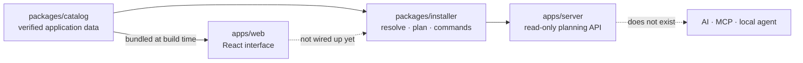

# ConfigShell

[](https://github.com/AbhiDevepl/configshell/actions/workflows/ci.yml)
[](LICENSE)
[](https://nodejs.org)
[](https://pnpm.io)

An open-source Linux software discovery and setup-plan generator.

ConfigShell helps users discover Linux applications, understand how compatible those
applications are with their system, and — with explicit consent — generate a validated
setup plan they run themselves. The core is **deterministic**: every recommendation and
every command comes from the verified catalog, not from a model.

AI is *stated future work*, not a dependency. When it lands it will reason about software
and propose plans; it will never be granted unrestricted access to the operating system,
and the product must remain fully usable without it.

> **Status: V1 in development. Nothing here installs software yet.**
> This README separates what is implemented from what is planned, and says so at every
> point. Anything described as "planned" or "future work" does not exist in the code.

**Quick links:** [What works today](#what-exists-today) ·
[Install](#installation) · [Development](#development) ·
[Contributing](docs/CONTRIBUTING.md) · [Roadmap](docs/ROADMAP.md) ·
[Good first issues](.github/GOOD_FIRST_ISSUES.md) · [Security](docs/SECURITY.md)

---

## What this project is

A curated catalog of Linux applications plus an interface for choosing the ones you want —
with, eventually, a safe path from "I want these applications" to "they are installed",
that never puts a shell behind a web page.

**Why it exists.** Setting up a fresh Linux system means identifying your distribution,
knowing its package ecosystem, checking whether each application is in the default
repositories, finding the right installation method, and copying commands from a dozen
websites. The information is scattered, often outdated, and frequently wrong for your
distribution specifically. This project's answer is a small, *verified* catalog and a flow
that is honest about what it does not know.

The intended end-to-end experience:

1. **Discover** Linux applications from a curated catalog.
2. **Understand** compatibility with your system (distribution, architecture, desktop
   environment, package managers, installed software).
3. **Search and filter** by name, category, and other attributes.
4. **Select** multiple applications.
5. **Generate a safe installation plan** that resolves each application against the catalog.
6. **Eventually** use AI to recommend and plan workflows, expose controlled capabilities
   through MCP, and let a local Linux agent perform validated system operations.

### Non-negotiable safety principles

- The browser **never** directly executes arbitrary shell commands.
- AI **never** receives unrestricted system access.
- System-changing operations must go through a **trusted local agent** with validation and
  explicit user confirmation.
- Applications must resolve against the **trusted catalog** — untrusted manifests are never
  installed.

See [Security](#security) and [`docs/security-model.md`](docs/security-model.md) for the full model.

---

## What exists today

- **A working web interface** (`apps/web`) — Vite + React 19 + TypeScript + Tailwind CSS v4
  + [shadcn/ui](https://ui.shadcn.com) (Radix UI base). A browser-only "does this look like
  Linux" indicator, manual distribution selection (Ubuntu, Debian, Fedora, Arch Linux), a
  searchable and filterable application browser, selectable application cards, a selection
  summary (sidebar on desktop, sheet + sticky bottom bar on mobile), and a dark/light theme
  toggle that defaults to dark. **Nothing on this page installs, executes, or generates a
  command** — the "Continue" button is intentionally inert.

- **A real, verified application catalog** (`packages/catalog`) — 31 applications across
  seven categories, with 116 installation sources whose identifiers were each checked
  against an authoritative source (the distribution's own package database, Flathub, the
  Snap Store, or vendor documentation). It is the single source of truth for application
  metadata; the web app consumes it via `@configshell/catalog` and owns no
  application data of its own. Support is explicit per distribution rather than assumed,
  unverified identifiers are omitted rather than guessed, version numbers are never
  recorded, and each source is labelled `distro` / `vendor` / `community` so third-party
  repackagings are not presented as vendor-official. The catalog is inert descriptive data:
  it contains **no commands**, and nothing acts on it yet. See
  [`docs/catalog.md`](docs/catalog.md).

- **The deterministic core** (`packages/installer`) — resolution, setup-plan generation and
  command generation, as three pure functions with no I/O and no execution. Given a
  selection and an environment it picks an installation source (and records why, and what it
  rejected), builds an ordered plan as structured data, and renders the exact commands a user
  would run. Sources needing a third-party repository are deliberately skipped in favour of
  the vendor's own instructions, so a generated command never fails on a clean system. 44
  tests, including that no generated command can contain a shell metacharacter.

- **A read-only planning API** (`apps/server`) — Express, with a health endpoint, catalog
  browse/search/lookup, supported-environment discovery, and `POST /api/plan`. It **plans and
  validates; it never executes** — there is no `child_process` import in the workspace and a
  test asserts there never is one. No database, no authentication, no sessions. 41 tests.

- **Repository tooling** — pnpm workspaces, repository-wide ESLint, per-workspace
  typechecking, 122 tests across three workspaces, and CI that runs all of it on Node 20
  and 22.

**Not implemented (planned):** the setup-plan and command-generation **user interface** —
the core exists and is tested, but the web app does not yet show a plan or a command, and its
"Continue" button is still inert. Also unimplemented: system detection beyond "does the
browser look like Linux", application detail pages, application icons, AI features, the MCP
server, the local Linux agent, database storage, and authentication. See
[`ROADMAP.md`](docs/ROADMAP.md).

*There is no screenshot or demo in this README yet — run it locally with `pnpm dev`; it
takes about a minute.*

---

## Architecture

The platform is designed around a strict separation of layers:

```
UI                 ✻  React web application
   ↓
Application Catalog   Curated application data, independent of the UI
   ↓
System Detection      What the user's Linux system looks like
   ↓
AI / Planning         Recommendation, compatibility, and plan generation
   ↓
MCP                   A controlled, tool-based interface for external clients
   ↓
Local Agent           Runs on the user's machine — Future scope, nothing implements it
   ↓
Validated System
Operation             The only layer that can change the system
```

**The catalog, the interface, and the deterministic planning core between them exist.**
AI, MCP and the local agent do not:



The dashed edge from the web app is the honest part: the core is built and tested, but the
interface does not yet render a plan or a command.

Each layer is intentionally decoupled so security boundaries can be enforced at each hop:
nothing downstream runs arbitrary input, and nothing upstream can touch the operating
system directly. Full detail — including what is implemented versus planned — is in
[`docs/architecture.md`](docs/architecture.md).

---

## Current V1 scope

V1 is a **Ninite-style installer-command generator, not an installer**: it stops at
generating a terminal command that the user copies and runs themselves.

```
Website → Linux detection state → Distribution selection → Application catalog
→ Application selection → Installer resolution → Terminal command generation
→ Copy to terminal → user runs it themselves
```

| Piece | Status |
| ----- | ------ |
| Linux application discovery (UI + verified catalog) | **implemented** |
| Manual distribution selection (Ubuntu / Debian / Fedora / Arch Linux) | **implemented** |
| Browser-only "looks like Linux" detection | **implemented** |
| Search | **implemented** |
| Category filtering | **implemented** |
| Application selection + selection summary | **implemented** |
| Responsive interface | **implemented** |
| Dark/light theme toggle (dark by default) | **implemented** |
| Verified application catalog (31 apps, metadata only) | **implemented** |
| Installer resolution (APT/DNF/Pacman/Flatpak/Snap) | **implemented** (`packages/installer`) |
| Setup-plan generation, ordered and deterministic | **implemented** (`packages/installer`) |
| Terminal command generation | **implemented** (`packages/installer`) |
| Installation verification commands | **implemented** (`packages/installer`) |
| Read-only planning API | **implemented** (`apps/server`) |
| Plan/command **user interface** + copy to clipboard | not started |
| Application details | not started |

V1 does **not** include real package installation, arbitrary shell execution, MCP, AI, or a
local agent — those are out of scope for V1 entirely.

### Important distro detection rule

Normal browser APIs cannot reliably identify which Linux distribution a visitor is running.
`apps/web/src/hooks/useLinuxDetection.ts` only ever reports whether the browser *looks like*
Linux (and explicitly excludes Android, which also reports "Linux" in its user agent) —
never a specific distribution. Exact distribution is always a manual, explicit choice in the
selector. True system-level distro detection is a future local-agent capability, not a
browser one.

### Application catalog categories

Browsers · Code Editors · CLI Tools · Development · Utilities · Media · Communication

Every application belongs to exactly one category. See
[`docs/catalog.md`](docs/catalog.md).

---

## Tech stack

| Layer | Technology |
| ----- | ---------- |
| Web interface | React 19, Vite, TypeScript, Tailwind CSS v4, shadcn/ui (Radix UI), Lucide icons, Geist font |
| API server | Node.js, Express — read-only catalog and planning endpoints |
| Deterministic core | TypeScript, no dependencies (`packages/installer`) |
| Shared packages | TypeScript, no build step (`tsx` runs the server directly) |
| Monorepo | pnpm workspaces (no Turborepo pipeline — root pnpm scripts orchestrate) |
| Lint / types / tests | ESLint (flat config), `tsc --noEmit`, Node's built-in test runner |
| CI | GitHub Actions, Node 20 and 22 |
| Planned | AI/LLM providers, MCP, a local Linux agent, PostgreSQL, Zod, Vitest, Playwright |

---

## Repository structure

```
apps/
├── server/            Read-only planning API — plans and validates, never executes
│   ├── app.js         Express app factory; index.js is the only file that listens
│   ├── config/        validated configuration — fails startup on a bad value
│   ├── controllers/   thin: validate → call a service → send
│   ├── middleware/    request context, 404, error handling
│   ├── routes/        the whole API surface in one table
│   ├── services/      catalog access + plan generation (no application data)
│   ├── utils/         structured logger, response envelope
│   ├── validators/    the untrusted-input boundary
│   └── .env.example   environment template (all values optional)
└── web/               React web app (shadcn/ui on Tailwind v4)
    ├── src/
    │   ├── components/
    │   │   ├── ui/            shadcn-generated primitives
    │   │   ├── layout/        header, theme toggle
    │   │   ├── detection/     Linux detection card
    │   │   ├── distro/        distribution selector
    │   │   ├── applications/  catalog list, search/filter, cards
    │   │   └── selection/     selection summary, list, sticky bar
    │   ├── data/distros.ts    selector copy (the Distro type comes from the catalog)
    │   ├── hooks/             useLinuxDetection, useTheme
    │   └── lib/utils.ts       `cn` re-export
    ├── server.js              static server for the production build
    ├── components.json        shadcn/ui config
    └── vite.config.ts

packages/
├── ai/                placeholder — no source (docs/ai.md)
├── catalog/           verified application catalog — single source of truth
│   └── src/           types.ts · applications.ts · environment.ts · query.ts · validate.ts
├── installer/         the deterministic core — resolution, plan, commands
│   └── src/           policy.ts · resolve.ts · plan.ts · commands.ts · types.ts
└── mcp/               placeholder — no source (docs/mcp.md)

docs/                  architecture · catalog · security · development · ai · agent · mcp
.github/               CI workflow, issue/PR templates, CODEOWNERS, Dependabot, good first issues
```

Each workspace has its own README describing what is real in it.

---

## Requirements

- **Node.js >= 20** (developed on 20 and 22; CI runs both)
- **pnpm 9.15.5** (pinned in `package.json` via `packageManager`)
- git

```sh
corepack enable
corepack prepare pnpm@9.15.5 --activate
```

Nothing in this repository requires root, installs system packages, or modifies your
machine.

## Installation

```sh
git clone https://github.com/AbhiDevepl/configshell.git
cd configshell
pnpm install
```

## Environment setup

**Optional.** The web app reads no environment variables and the server starts without any.
For the server:

```sh
cp apps/server/.env.example apps/server/.env
```

| Variable | Used by | Required | Default |
| -------- | ------- | -------- | ------- |
| `PORT` | `apps/server` (and `apps/web`'s `server.js`, from the process environment) | no | `3000` |
| `NODE_ENV` | `apps/server` | no | `development` |
| `DISABLE_HMR` | `apps/web` dev server | no | unset |

Invalid values fail server startup with an explanatory error rather than being ignored.
There are deliberately **no** AI keys, database URLs, or auth secrets — nothing in the
repository implements a feature that needs one. `.env` files are git-ignored; never put a
real secret in a `.env.example`. Details in [`docs/development.md`](docs/development.md).

## Development

```sh
pnpm dev                    # web app → http://localhost:3000
```

Per workspace:

```sh
pnpm --filter web dev       # Vite dev server, port 3000
pnpm --filter web build     # production build → apps/web/dist
pnpm --filter web preview   # preview the production build
pnpm --filter web start     # serve apps/web/dist (needs a build first)
pnpm --filter server dev    # planning API (tsx watch) — http://localhost:3000/health
```

> Both default to port 3000. Set `PORT` in `apps/server/.env` to run them together.

### Checks

```sh
pnpm check       # lint → typecheck → test → build (what CI runs)

pnpm lint        # ESLint across the repository
pnpm typecheck   # tsc --noEmit for apps/web and packages/catalog
pnpm test        # catalog test suite (+ apps/server, which has no test files yet)
pnpm build       # production build of apps/web
```

There is no formatter to run — `.editorconfig` covers the basics; match the file you are
editing.

## Testing

**122 tests** on Node's built-in runner (via `tsx`), across three workspaces:

```sh
pnpm test                                        # all of them
pnpm --filter @configshell/catalog test          # 37 — validates the real catalog data
pnpm --filter @configshell/installer test        # 44 — resolution, plans, command safety
pnpm --filter server test                        # 41 — API integration, against the real app
```

They test real data and the real application rather than fixtures and mocks: the catalog
suite validates all 31 entries, the installer suite asserts that no generated command can
contain a shell metacharacter on any distribution, and the server suite drives the actual
Express app over HTTP.

`apps/web` still has **no test runner at all** — that is the largest remaining gap. See
[`.github/GOOD_FIRST_ISSUES.md`](.github/GOOD_FIRST_ISSUES.md).

---

## Contributing

Contributions are welcome, and the most useful ones right now are catalog additions, tests,
and documentation fixes.

- [`CONTRIBUTING.md`](docs/CONTRIBUTING.md) — setup, branch and commit conventions, pull request
  process, and what reviewers look for.
- [`.github/GOOD_FIRST_ISSUES.md`](.github/GOOD_FIRST_ISSUES.md) — 16 real tasks with the
  files each one touches.
- [`CODE_OF_CONDUCT.md`](docs/CODE_OF_CONDUCT.md) — expected conduct in every project space.
- [`MAINTAINERS.md`](docs/MAINTAINERS.md) — who maintains what and who decides what.
- [`SUPPORT.md`](docs/SUPPORT.md) — where questions go.

House rules, in short: keep features modular, avoid unnecessary dependencies, keep catalog
data separate from the UI, never introduce unsafe command execution, add tests for
important functionality, keep pull requests focused, and never document or display
functionality that does not exist.

---

## Security

Security is a design constraint, not an afterthought:

- **No arbitrary shell execution from the browser.**
- **No remote sudo.** Privileged operations are never exposed over a remote interface.
- **No unrestricted command execution.** All operations are scoped and validated.
- **AI cannot control the operating system.** It plans and recommends; it never executes.
- **Installation requests must be validated** before execution.
- **Applications must resolve against the trusted catalog.**
- **System-changing operations require explicit user confirmation.**
- **Privileged operations belong in the local agent** — the only component allowed to change
  a system.
- **Security-sensitive operations are logged** and auditable.

The full model is in [`docs/security-model.md`](docs/security-model.md). To **report a vulnerability**,
follow [`SECURITY.md`](docs/SECURITY.md) — not a public issue.

---

## Documentation

| Document | What it covers |
| -------- | -------------- |
| [`docs/ProductRequirements.md`](docs/ProductRequirements.md) | The PRD — product vision, scope, and MVP definition |
| [`docs/TechnicalAudit.md`](docs/TechnicalAudit.md) | Audit of the repository against the PRD: gap analysis, risks, resolved decisions, and the prioritised backlog |
| [`docs/development.md`](docs/development.md) | Setup, commands, environment, troubleshooting |
| [`docs/architecture.md`](docs/architecture.md) | Layer separation; implemented vs. planned |
| [`docs/catalog.md`](docs/catalog.md) | Catalog schema, verification rules, how to add an application or a distribution |
| [`docs/security-model.md`](docs/security-model.md) | The security model |
| [`docs/ai.md`](docs/ai.md) | AI planning layer — **not started**; constraints for any implementation |
| [`docs/mcp.md`](docs/mcp.md) | MCP interface — **not started**; intended shape and rules |
| [`docs/agent.md`](docs/agent.md) | Local Linux agent — **not started**; rules it must follow |
| [`ROADMAP.md`](docs/ROADMAP.md) | Done, current, planned, and explicitly out of scope |
| [`CHANGELOG.md`](docs/CHANGELOG.md) | Notable changes and the versioning policy |
| [`THIRD_PARTY_NOTICES.md`](docs/THIRD_PARTY_NOTICES.md) | Third-party licenses and attribution |

`CLAUDE.md` holds working notes for AI coding assistants used on this repository; it is not
required reading for contributors, but it is kept accurate.

---

## Roadmap

| Milestone | Contents |
| --------- | -------- |
| **V1 — Discovery** | Web foundation ✅, application catalog ✅, search/filtering ✅, selection flow ✅, installer resolution ✅, setup plan ✅, command generation ✅, planning API ✅ — remaining: the plan/command **interface**, application details |
| **V2 — Intelligence** | AI recommendations, compatibility analysis, natural-language discovery, installation planning |
| **V3 — MCP** | MCP server, resources, tools, tool authorization |
| **V4 — Local agent** | Linux system detection, package-manager detection, installation validation, confirmed installation |
| **V5 — Production** | Database, accounts, catalog management, community contributions, infrastructure |

Details, including what is deliberately **not** on the roadmap, are in
[`ROADMAP.md`](docs/ROADMAP.md).

---

## License

Distributed under the **Apache License 2.0** — see [`LICENSE`](LICENSE) for the full text
and [`NOTICE`](docs/NOTICE) for the copyright notice. Third-party components and their licenses
are listed in [`THIRD_PARTY_NOTICES.md`](docs/THIRD_PARTY_NOTICES.md).

Application names in the catalog are trademarks of their respective owners; this project is
not affiliated with or endorsed by any of them and redistributes none of their software.

## Maintainers

Created and maintained by **AbhiDevepl** and **tejjasdev** — see
[`MAINTAINERS.md`](docs/MAINTAINERS.md).

GitHub: [AbhiDevepl/configshell](https://github.com/AbhiDevepl/configshell)
