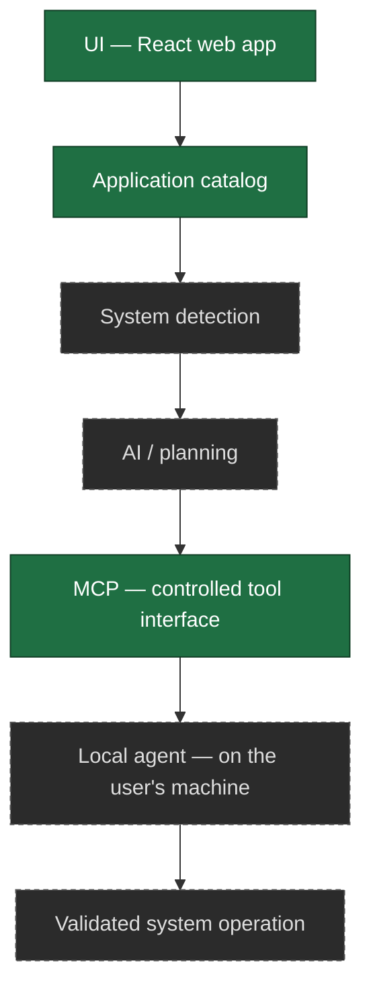
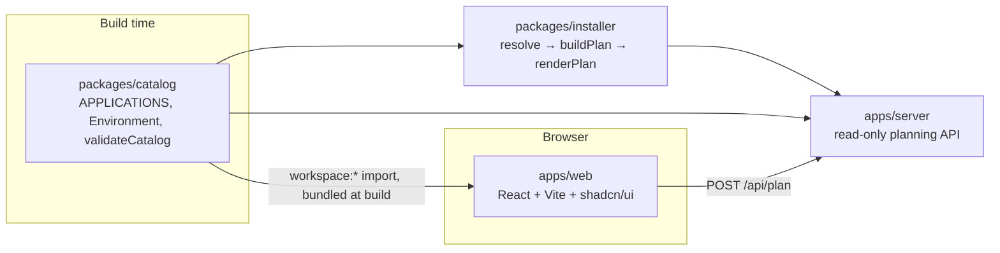

# Architecture

This document describes two things, kept separate: what is actually implemented today,
and the long-term architecture the project is working toward. Do not read the long-term
section as shipped functionality — check the "Current implementation" section (or the repo
itself) for what actually runs.

## Long-term architecture (planned)

The platform is designed around a strict separation of layers:

```
UI                 ✻  React web application
   ↓
Application Catalog   Curated application data, independent of the UI
   ↓
System Detection      What the user's Linux system looks like
   ↓
AI / Planning         Recommendation, compatibility, and plan generation
   ↓
MCP                   A controlled, tool-based interface for external clients ✅
   ↓
Local Agent           Runs on the user's machine — Future scope, nothing implements it
   ↓
Validated System
Operation             The only layer that can change the system
```

The **Local Agent** layer is deliberately listed here even though it is unstarted: the
security model's "privileged operations belong in the local agent" principle only makes
sense if the layer is named. See [`agent.md`](agent.md) for the rules it must follow, and
[`ROADMAP.md`](ROADMAP.md) for where it sits (post-core, after MCP).

Each layer is intentionally decoupled so security boundaries can be enforced at each hop:
nothing downstream runs arbitrary input, and nothing upstream can touch the operating
system directly. See `docs/security-model.md` for the security model this enables.



Solid boxes exist today; dashed boxes do not.

## V1 architecture (in progress)

V1 narrows the long-term pipeline to a smaller, concrete flow that stops before any system
access:

```
Website → Linux detection state → Distribution selection → Application catalog
→ Application selection → Installer resolution → Terminal command generation
→ Copy to terminal → user runs it themselves
```

The website never executes anything — it ends at a command the user copies and runs in
their own terminal. Installer resolution and command generation are not part of Phase 1
(see below).

## Current implementation

The catalog, the deterministic core, and a read-only API over it all exist:



The catalog is *compiled into* the web bundle; it is not fetched at runtime. Browsing,
search, category filtering and role presets therefore work with no server at all.

The web app makes **exactly one kind of network request**: `POST /api/plan`. That split is
deliberate. The web app could import `packages/installer` directly, but that would put the
one security-critical function in the browser bundle and give two consumers two places to
drift apart. The cost is visible rather than hidden: without the API you can browse and
select but not generate a plan, and the UI says exactly that instead of degrading quietly.

### The three stages, and why they are separate

```
resolve()      (application, environment)  →  which source, and why
buildPlan()    (resolutions, environment)  →  ordered steps, as DATA
renderPlan()   (plan)                      →  command strings
```

This split is the security model rather than tidiness. `renderPlan` is the **only** code in
the repository that knows `apt` means `apt-get install`; everything before it is structured
data that cannot contain a shell fragment. That keeps the dangerous step small enough to
test exhaustively, and it is what lets a future CLI or MCP server reuse resolution and
planning without inheriting command generation.

It is also why the core lives in a package rather than in `apps/web` or `apps/server`. Both
are consumers. Neither owns the logic, and neither may reimplement it.

The web app owns no application data. It reads `APPLICATIONS` from the catalog package and
renders it; search, category filtering and selection all operate on catalog entries, keyed
on `Application.id`. The Phase 1 fixture `apps/web/src/data/mockCatalog.ts` has been
deleted, so there is exactly one source of truth. The `Distro` union is likewise defined in
the catalog and imported by `apps/web/src/data/distros.ts`, which now only supplies the
selector's presentation copy.

Nothing downstream of the catalog exists yet: no installer resolver, no command generation,
no execution. The catalog carries the structured metadata those layers will need
(`method`, `identifier`, `origin`, `distros`) and stops there.

### `packages/catalog` — the shared catalog

TypeScript source, no build step; `apps/web` depends on it via `workspace:*` and both Vite
and `tsc` resolve it through the pnpm symlink. Holds the data model, 31 verified
applications, a dependency-free validation function, and its own test suite (Node's test
runner via `tsx`). See `docs/catalog.md` for the schema, the verification rules, and what
is deliberately absent.

### `apps/web` — the UI layer

Implements the whole deterministic flow: environment (OS + distribution) → optional role
presets → browse/search/filter → application detail → selection → setup plan → commands.
Two views held in `App.tsx`, which owns selection state: `build` (one scrollable page,
because every part of it is revised while looking at the rest) and `plan`.

It must **not** import `@configshell/installer` — one implementation of command generation,
not two. Plan generation goes through `src/lib/api.ts`.


Built primarily from **shadcn/ui** (Radix UI base) components under
`src/components/ui/` (button, card, badge, checkbox, radio-group, input, toggle-group,
separator, scroll-area, alert, sheet, empty, label, tooltip) rather than hand-rolled
markup. `components.json` holds the shadcn config; see `CLAUDE.md`'s "shadcn/ui setup"
section before adding more components or touching the `@/*` import alias.

- `src/App.tsx` composes the page inside a `TooltipProvider`: `SiteHeader` (layout),
  `LinuxDetectionCard` (detection), `DistroSelector` (distro), `AppCatalog` (applications,
  which renders `AppCard`s), `SelectionSummary` (selection, desktop sidebar), and
  `SelectionBar` (selection, sticky bottom bar — a sheet + inert "Continue" button on
  mobile).
- `src/hooks/useLinuxDetection.ts` — a browser-only signal for whether the visitor *looks
  like* they're on Linux (via `navigator.userAgentData`/`userAgent`, excluding Android).
  It never attempts to name a specific distribution — browsers can't reliably do that.
- `src/hooks/useTheme.ts` — a dark-first light/dark toggle (`.dark` class on `<html>`,
  persisted to `localStorage`); the actual color tokens come from shadcn's own
  `src/index.css` output, not hand-rolled.
- `src/data/distros.ts` — presentation copy for the four selectable distributions. The
  `Distro` union itself is imported from `@configshell/catalog`, not redefined.
- Application data comes entirely from `@configshell/catalog`. There is no local
  catalog file.
- State (selected distro, selected application ids, search query, active category filter)
  lives in `App.tsx`/local component state — there is no global store, no backend calls,
  and no persistence. Nothing survives a page refresh.

### `apps/server` — the planning API

A read-only HTTP surface over the catalog and the installer: health, catalog
browse/search/lookup, supported-environment discovery, and `POST /api/plan`. Controllers
are thin (validate → call a service → send); no application data and no installation
decision lives in this workspace.

**It plans and validates; it never executes.** There is no `child_process` import in the
workspace and an integration test asserts there never is one. A server that ran
package-manager commands on a user's behalf would be remote sudo — permanently out of
scope, not merely unscheduled. Execution belongs to a local agent on the user's own machine
(`docs/agent.md`).

No database, no authentication, no sessions: nothing here needs one. The catalog is
Git-managed data compiled into the process (PRD §33) and every endpoint is a pure function
of the request.

The server is JavaScript importing the workspace's TypeScript packages directly, run under
`tsx`, so the monorepo still has no build step. `tsconfig.json` runs `checkJs` over it, so
misuse of the catalog or installer APIs is caught by `pnpm typecheck`.

The web app does **not** call it. `apps/web` compiles the catalog into its bundle, which is
simpler and safer than a round trip; the API exists for consumers that cannot do that — a
CLI, an MCP server, or anything else that should reuse resolution rather than reimplement
it. See `apps/server/README.md`.

### `packages/installer` — the deterministic core

Pure functions over `(catalog, environment)`: no I/O, no filesystem, no network, no
execution. Encodes PRD §22's source-trust hierarchy explicitly (`policy.ts`), so "which
source did you pick, and why" is a tested, documented answer rather than catalog order.

Sources that need a third-party repository added first are **excluded** and become a manual
step pointing at the vendor's instructions — a provisional decision recorded in
`docs/TechnicalAudit.md` §9 (Q1), localised to one predicate so it can be revisited without
reshaping the resolver. Applications with no route at all are reported, never dropped.

Verification commands come from one fixed template (`command -v <binary>`). The catalog has
no field that could carry a check *command*, deliberately: that is precisely the field
through which arbitrary strings would reach a shell.

See `packages/installer/README.md`.

### `packages/mcp` — the MCP interface

A stdio MCP server exposing **seven read-only, deterministic tools** over the catalog and the
installer: environment discovery, catalog search, application detail, role presets,
compatibility checking, setup-plan generation, and plan validation.

It is a thin adapter — every decision comes from `packages/installer`, so an MCP client
cannot get a different answer from the web app or the API. It does not go through the HTTP
API: both are adapters over the same pure functions, and a network hop between them would add
a failure mode without adding a guarantee.

**Three capabilities are deliberately absent rather than stubbed:** `detect_system`,
`check_installed` and `execute_setup` all require the local agent. A tool that always fails is
still a tool a caller must handle; one that returns a plausible guess would be a lie.

Zero runtime dependencies — the JSON-RPC layer is hand-written rather than pulling in the
official SDK's seventeen transitive dependencies. See `docs/mcp.md`.

### `packages/ai`

Placeholder for the AI planning layer: a `package.json` and a README, no source. No work
started, and none planned for the current release. See `docs/ai.md`.

## Repository tooling

- **Package manager:** pnpm workspaces (`apps/*`, `packages/*`), pinned via
  `packageManager`. Root `package.json` scripts orchestrate the workspaces with pnpm
  filters. There is deliberately **no Turborepo pipeline** — the dependency graph (one app
  consuming one package) does not justify one yet.
- **Lint:** one flat ESLint config at the root (`eslint.config.js`) covering every
  workspace; `pnpm lint`.
- **Types:** `tsc --noEmit` per TypeScript workspace; `pnpm typecheck`.
- **Tests:** Node's built-in runner. `packages/catalog` is the only workspace with tests.
- **CI:** `.github/workflows/ci.yml` runs install, lint, typecheck, test and build on
  pushes to `main` and on pull requests, against Node 20 and 22.

See `docs/development.md` for the commands and `CONTRIBUTING.md` for the workflow.

## What is deliberately still missing

- **Component-level tests for `apps/web`.** The flow works and the API client is tested, but
  no DOM test runner is installed, so component behaviour is unverified. This is the largest
  gap in the repository.
- **Repository-setup steps.** Sources needing a third-party repository are skipped by
  design, provisionally (Q1). ConfigShell adds no apt sources file and no signing key.
- **Execution of any kind**, anywhere. The browser does not run commands, and neither does
  the server.
- **AI, MCP, the local agent, a database and authentication** — later milestones, not
  missing pieces of this one.

The boundary worth restating: `packages/catalog` and `apps/web` still build, store and
display **no shell command**. Only `packages/installer`'s `renderPlan` produces command
text, and only from catalog data that is pattern-checked immediately before interpolation.
