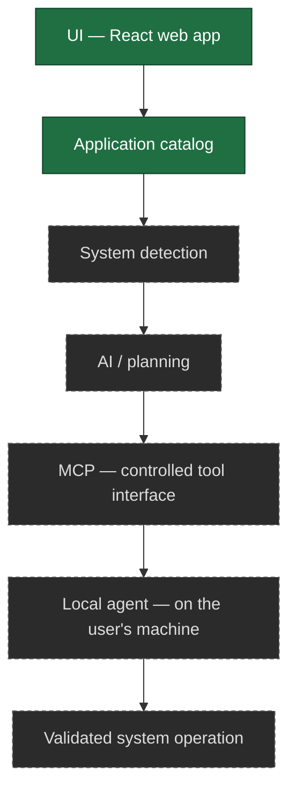
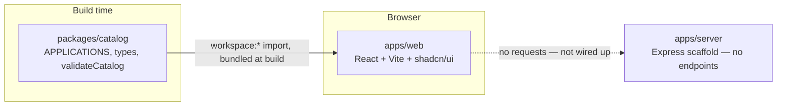

# Architecture

This document describes two things, kept separate: what is actually implemented today,
and the long-term architecture the project is working toward. Do not read the long-term
section as shipped functionality — check the "Current implementation" section (or the repo
itself) for what actually runs.

## Long-term architecture (planned)

The platform is designed around a strict separation of layers:

```
UI                 ✻  React web application
   ↓
Application Catalog   Curated application data, independent of the UI
   ↓
System Detection      What the user's Linux system looks like
   ↓
AI / Planning         Recommendation, compatibility, and plan generation
   ↓
MCP                   A controlled, tool-based interface for AI systems
   ↓
Local Agent           Runs on the user's machine; understands the OS
   ↓
Validated System
Operation             The only layer that can change the system
```

Each layer is intentionally decoupled so security boundaries can be enforced at each hop:
nothing downstream runs arbitrary input, and nothing upstream can touch the operating
system directly. See `docs/security.md` for the security model this enables.



Solid boxes exist today; dashed boxes do not.

## V1 architecture (in progress)

V1 narrows the long-term pipeline to a smaller, concrete flow that stops before any system
access:

```
Website → Linux detection state → Distribution selection → Application catalog
→ Application selection → Installer resolution → Terminal command generation
→ Copy to terminal → user runs it themselves
```

The website never executes anything — it ends at a command the user copies and runs in
their own terminal. Installer resolution and command generation are not part of Phase 1
(see below).

## Current implementation (as of Phase 2)

Two layers of the long-term pipeline now exist, and the boundary between them is real:



The catalog is *compiled into* the web bundle; it is not fetched at runtime. There is no
client/server communication in the product today — the dashed edge above does not exist in
code.

The web app owns no application data. It reads `APPLICATIONS` from the catalog package and
renders it; search, category filtering and selection all operate on catalog entries, keyed
on `Application.id`. The Phase 1 fixture `apps/web/src/data/mockCatalog.ts` has been
deleted, so there is exactly one source of truth. The `Distro` union is likewise defined in
the catalog and imported by `apps/web/src/data/distros.ts`, which now only supplies the
selector's presentation copy.

Nothing downstream of the catalog exists yet: no installer resolver, no command generation,
no execution. The catalog carries the structured metadata those layers will need
(`method`, `identifier`, `origin`, `distros`) and stops there.

### `packages/catalog` — the shared catalog

TypeScript source, no build step; `apps/web` depends on it via `workspace:*` and both Vite
and `tsc` resolve it through the pnpm symlink. Holds the data model, 31 verified
applications, a dependency-free validation function, and its own test suite (Node's test
runner via `tsx`). See `docs/catalog.md` for the schema, the verification rules, and what
is deliberately absent.

### `apps/web` — the UI layer

Built primarily from **shadcn/ui** (Radix UI base) components under
`src/components/ui/` (button, card, badge, checkbox, radio-group, input, toggle-group,
separator, scroll-area, alert, sheet, empty, label, tooltip) rather than hand-rolled
markup. `components.json` holds the shadcn config; see `CLAUDE.md`'s "shadcn/ui setup"
section before adding more components or touching the `@/*` import alias.

- `src/App.tsx` composes the page inside a `TooltipProvider`: `SiteHeader` (layout),
  `LinuxDetectionCard` (detection), `DistroSelector` (distro), `AppCatalog` (applications,
  which renders `AppCard`s), `SelectionSummary` (selection, desktop sidebar), and
  `SelectionBar` (selection, sticky bottom bar — a sheet + inert "Continue" button on
  mobile).
- `src/hooks/useLinuxDetection.ts` — a browser-only signal for whether the visitor *looks
  like* they're on Linux (via `navigator.userAgentData`/`userAgent`, excluding Android).
  It never attempts to name a specific distribution — browsers can't reliably do that.
- `src/hooks/useTheme.ts` — a dark-first light/dark toggle (`.dark` class on `<html>`,
  persisted to `localStorage`); the actual color tokens come from shadcn's own
  `src/index.css` output, not hand-rolled.
- `src/data/distros.ts` — presentation copy for the four selectable distributions. The
  `Distro` union itself is imported from `@linux-app-platform/catalog`, not redefined.
- Application data comes entirely from `@linux-app-platform/catalog`. There is no local
  catalog file.
- State (selected distro, selected application ids, search query, active category filter)
  lives in `App.tsx`/local component state — there is no global store, no backend calls,
  and no persistence. Nothing survives a page refresh.

### `apps/server` — scaffold only, serves nothing

The directory structure (`controllers/`, `services/`, `routes/`, `middleware/`,
`validators/`, `utils/`, `config/`) exists, but the only files with code are `index.js` —
which starts an Express app with no routes registered — and `config/env.js` /
`config/index.js`, which read and validate `PORT` and `NODE_ENV` and fail startup loudly on
an invalid value. Everything else is 0 bytes.

The server starts and listens; it has no endpoints. No API exists for the web app to call,
and the web app does not attempt to call one. Adding the first endpoint is an
architectural decision (the catalog is currently compiled into the browser bundle), not a
small change — open an issue first.

### `packages/ai`, `packages/mcp`

Placeholders for the AI planning and MCP layers: a `package.json` and a README each, no
source. No work started. See `docs/ai.md` and `docs/mcp.md` for the constraints any
implementation must satisfy.

## Repository tooling

- **Package manager:** pnpm workspaces (`apps/*`, `packages/*`), pinned via
  `packageManager`. Root `package.json` scripts orchestrate the workspaces with pnpm
  filters. There is deliberately **no Turborepo pipeline** — the dependency graph (one app
  consuming one package) does not justify one yet.
- **Lint:** one flat ESLint config at the root (`eslint.config.js`) covering every
  workspace; `pnpm lint`.
- **Types:** `tsc --noEmit` per TypeScript workspace; `pnpm typecheck`.
- **Tests:** Node's built-in runner. `packages/catalog` is the only workspace with tests.
- **CI:** `.github/workflows/ci.yml` runs install, lint, typecheck, test and build on
  pushes to `main` and on pull requests, against Node 20 and 22.

See `docs/development.md` for the commands and `CONTRIBUTING.md` for the workflow.

## What Phase 2 deliberately does not include

Per the V1 phase plan: installer resolution (APT/DNF/Pacman/Flatpak/Snap), terminal command
generation, clipboard install commands, any backend installation API, a database,
authentication, AI, MCP, and the local agent. These are later phases/milestones, not
missing pieces of Phase 2.

The catalog now *describes* installation sources, which makes the next boundary worth
stating precisely: turning an `InstallationSource` into a command is the resolver's job,
and the resolver does not exist. Nothing in `packages/catalog` or `apps/web` builds,
stores, or displays a shell command.
